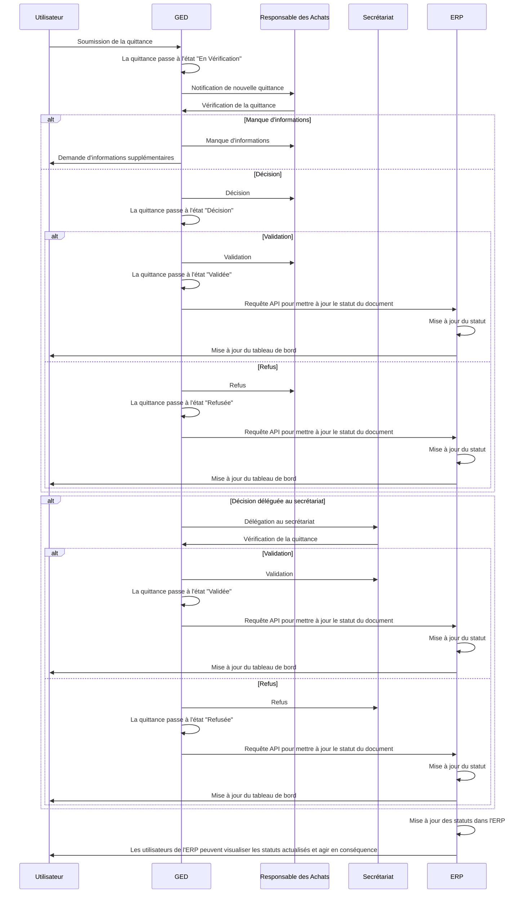

# Schéma du flux de validation modifié

```mermaid
sequenceDiagram
    participant User as Utilisateur
    participant GED as GED
    participant RA as Responsable des Achats
    participant Sec as Secrétariat
    participant ERP as ERP

    User->>GED: Soumission de la quittance
    GED->>GED: La quittance passe à l'état "En Vérification"
    GED->>RA: Notification de nouvelle quittance
    RA->>GED: Vérification de la quittance
    alt Manque d'informations
        GED->>RA: Manque d'informations
        GED->>User: Demande d'informations supplémentaires
    else Décision
        GED->>RA: Décision
        GED->>GED: La quittance passe à l'état "Décision"
        alt Validation
            GED->>RA: Validation
            GED->>GED: La quittance passe à l'état "Validée"
            GED->>ERP: Requête API pour mettre à jour le statut du document
            ERP->>ERP: Mise à jour du statut
            ERP->>User: Mise à jour du tableau de bord
        else Refus
            GED->>RA: Refus
            GED->>GED: La quittance passe à l'état "Refusée"
            GED->>ERP: Requête API pour mettre à jour le statut du document
            ERP->>ERP: Mise à jour du statut
            ERP->>User: Mise à jour du tableau de bord
        end
    end
    alt Décision déléguée au secrétariat
        GED->>Sec: Délégation au secrétariat
        Sec->>GED: Vérification de la quittance
        alt Validation
            GED->>Sec: Validation
            GED->>GED: La quittance passe à l'état "Validée"
            GED->>ERP: Requête API pour mettre à jour le statut du document
            ERP->>ERP: Mise à jour du statut
            ERP->>User: Mise à jour du tableau de bord
        else Refus
            GED->>Sec: Refus
            GED->>GED: La quittance passe à l'état "Refusée"
            GED->>ERP: Requête API pour mettre à jour le statut du document
            ERP->>ERP: Mise à jour du statut
            ERP->>User: Mise à jour du tableau de bord
        end
    end
    ERP->>ERP: Mise à jour des statuts dans l'ERP
    ERP->>User: Les utilisateurs de l'ERP peuvent visualiser les statuts actualisés et agir en conséquence

```